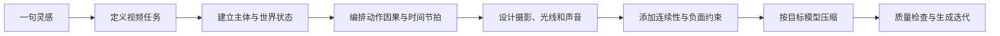

# Video Prompt Lab｜AI 视频提示词工程库

> 把一句灵感，编译成可拍、可控、可复现的 AI 视频提示词。

[](LICENSE)
[](https://agentskills.io)
[](#模型适配)
[](README_EN.md)

Video Prompt Lab 不是形容词合集，而是一套视频提示词工程方法。它把创意拆成主体、空间、动作、镜头、光线、声音、时间和约束，再针对不同模型压缩成可直接生成的版本。

## 为什么需要它

常见提示词只描述“画面好看”，却没有规定视频如何发生：人物为什么动、镜头为何移动、前后帧如何连续、声音何时出现。结果往往是动作漂移、镜头乱飞、物体变形和广告片式的空洞质感。

本仓库解决六类问题：

- **可执行性**：把抽象情绪翻译成能被摄影机记录的动作与环境现象。
- **时间性**：用节拍表明确每一秒发生什么，避免静态图像轻微晃动。
- **连续性**：锁定人物、服装、空间轴线、道具状态和动作因果。
- **镜头控制**：区分景别、机位、焦段、运动、速度和稳定方式。
- **模型适配**：同一创意分别输出自然语言版、结构化版和短提示版。
- **质量控制**：通过检查表和脚本发现冲突、空泛词与缺失字段。

## 30 秒快速开始

复制下面的“最小可用公式”，替换方括号内容：

```text
[时长与比例]。[主体身份与固定特征]在[具体地点与时间]完成[一个明确动作]。
动作因果：[起因] → [动作发展] → [可见结果]。
摄影：[景别]，[机位]，[焦段感]，[一种镜头运动]，[稳定方式]。
光线：[主光来源]，[色温与对比]，[随时间发生的变化]。
真实细节：[两项材质/环境细节]，[一个自然的小失误或次要事件]。
声音：[前景声]，[环境底噪]，[与动作同步的声音事件]。
连续性：人物、服装、道具、方向和空间关系始终一致。
避免：[最可能发生的 3—5 个错误]。
```

示例：

```text
10 秒，9:16。一个穿旧牛仔夹克的年轻外卖员在雨后凌晨的便利店门口整理被淋湿的纸袋。
一辆车驶过溅起积水，他下意识护住纸袋，确认封口后抬头看向街对面亮起的绿灯。
腰部高度的中景，约 35mm 纪实焦段，拍摄者缓慢后退一步跟随，不做环绕运镜。
便利店冷白灯从侧后方照亮雨滴，街道钠灯偏暖，自动曝光在车灯掠过时短暂压暗。
塑料雨衣粘在手臂上，鞋底带起细小水花；镜头跟随略慢半拍。
雨棚滴水、冰柜低鸣、远处轮胎压水声，纸袋摩擦声与手部动作同步。
人物脸、夹克、纸袋破损位置、行进方向始终一致。
避免多余手指、纸袋忽然复原、背景行人复制、无原因慢动作、文字乱码、镜头穿过人物。
```

## 提示词编译流程



详细方法见 [提示词工程基础](docs/prompt-engineering.md)。

## 仓库导航

| 你要做什么 | 直接打开 |
|---|---|
| 从零写一个提示词 | [通用生成模板](templates/text-to-video.md) |
| 让首帧图动起来 | [图生视频模板](templates/image-to-video.md) |
| 做连续多镜头叙事 | [多镜头模板](templates/multi-shot-story.md) |
| 做真实短视频/UGC | [短视频模板](templates/social-video.md) |
| 做产品广告 | [产品视频模板](templates/product-film.md) |
| 查运镜与焦段 | [镜头语言词典](references/camera-language.md) |
| 控制动作和一致性 | [运动与连续性](references/motion-continuity.md) |
| 设计灯光和颜色 | [灯光与色彩](references/lighting-color.md) |
| 设计声音 | [声音设计](references/sound-design.md) |
| 修复 AI 味和常见错误 | [负面提示与故障排查](references/negative-prompts.md) |
| 适配 Seedance/Veo/Sora/Kling/Runway | [模型适配指南](docs/model-adaptation.md) |
| 直接抄高质量案例 | [案例库](examples/README.md) |

## 模型适配

模型能力变化很快，因此本仓库不宣称存在永久有效的“神奇关键词”。适配策略集中在 [docs/model-adaptation.md](docs/model-adaptation.md)，核心原则是：

- **Seedance**：明确时间推进、主体动作和镜头调度，长描述要有优先级。
- **Veo**：把环境声、对白和同步事件写成可观察的音画关系。
- **Sora**：强调世界状态、空间关系、物理因果和镜头意图。
- **Kling**：图生视频时严格区分画面中已存在的内容与新增运动。
- **Runway**：提示词保持单一镜头目标，优先描述运动而非重复描述首帧。

这些是工作方法，不是对某个版本功能边界的保证。生成前应以目标产品当前界面和官方文档为准。

## Agent Skill

仓库根目录的 [SKILL.md](SKILL.md) 可作为支持 Agent Skills 的通用技能使用。它会：

1. 询问或推断视频用途、时长、比例、生成模式和目标模型；
2. 把抽象创意转成可见动作；
3. 输出主提示词、负面约束、连续性锁和迭代建议；
4. 在信息不足时采用保守默认值，而不是堆砌风格词。

安装示例：

```bash
git clone https://github.com/jupiterx0910-cloud/video-prompt-lab.git
```

然后将仓库或 `SKILL.md` 放入你的 Agent 技能目录。

## 质量检查

人工检查：

- 是否只有一个主要叙事目标？
- 主体外观和道具状态是否可锁定？
- 动作是否有起因、过程与结果？
- 镜头是否只承担一种主要运动？
- 光线变化是否有物理来源？
- 声音是否与时间轴对应？
- 负面约束是否针对本镜头，而非无穷堆词？

仓库结构检查：

```bash
python scripts/validate_repo.py
```

## 与参考项目的关系

本项目受到 [zhouwei713/seedance-prompt](https://github.com/zhouwei713/seedance-prompt)“从画面描述转向真实素材设计”方法的启发，并在此基础上重新设计了独立的信息架构、编译流程、模型适配、连续性系统、声音系统、模板和案例。代码与正文均为重新编写。

## 贡献

欢迎提交新的案例、模型适配经验和失败复盘。请阅读 [CONTRIBUTING.md](CONTRIBUTING.md)。不要提交来源不明的大段提示词，也不要把一次偶然成功包装成普遍规律。

## License

[MIT](LICENSE)
