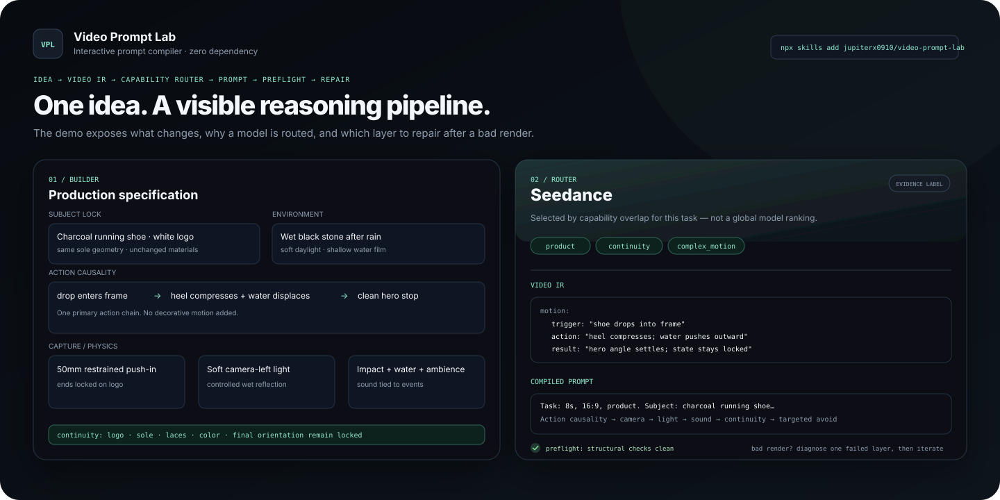

# Video Prompt Lab｜AI 视频提示词编译器

> **把一句灵感编译成可执行、可诊断、可迭代的视频制作规格，而不是堆一串“电影感”形容词。**

[](.github/workflows/validate.yml)
[](https://skills.sh/jupiterx0910/video-prompt-lab)
[](LICENSE)
[](router/models.json)
[](README_EN.md)

Video Prompt Lab 是一个面向 **文生视频、图生视频和 Agent 工作流** 的开源 Prompt Compiler。它先把创意规范化成 **Video IR（视频中间表示）**，再推导能力需求、解释模型路由、编译 Prompt、做 preflight；生成失败后，不重写整条 Prompt，而是先定位失败层。

```bash
npx skills add jupiterx0910/video-prompt-lab
```

**三个入口：** [体验交互式 Demo](demo/index.html) · [安装 Agent Skill](SKILL.md) · [阅读编译器架构](docs/prompt-compiler-v2.md)



## 30 秒理解这个项目

```text
一句灵感
   ↓
Video IR：主体 / 世界状态 / 动作因果 / 镜头 / 时间 / 物理 / 声音 / 连续性
   ↓
能力需求：I2V？对白音频？多镜头？复杂运动？产品一致性？
   ↓
Model Router：按能力匹配，而不是做永久排行榜
   ↓
模型化 Prompt：保留导演意图，按目标模型压缩
   ↓
Preflight：冲突、连续性、物理、声音、模型能力缺口
   ↓
生成 → 失败诊断 → 只改 1–2 个变量 → 再生成
```

普通 Prompt 库主要告诉你“**写什么词**”。Video Prompt Lab 更关心“**这个视频为什么会按这种方式发生，以及失败后该改哪一层**”。

| 普通做法 | Video Prompt Lab |
|---|---|
| 先写一大段漂亮文字 | 先建立 Video IR，再编译成文字 |
| 直接问“哪个模型最好” | 先拆能力需求，再解释为什么匹配某个模型 |
| 情绪靠“高级、电影感、震撼” | 情绪翻译成动作、构图、光线、声音和留白 |
| 动作只写结果 | 写 `触发 → 反应/动作 → 可见后果` |
| 镜头词越多越好 | 每镜头只保留一个主运动和明确结束构图 |
| 生成失败就重写整条 Prompt | 先判断身份、物体状态、运动、镜头、时间、物理、音频还是模型适配失败 |
| 凭感觉升级 Skill | 用确定性 eval + GitHub Actions 防止结构性回退 |

这不是在承诺“Prompt 能保证出片”。模型生成仍然具有随机性。工程化的价值在于：**让你知道自己在控制什么、为什么失败、下一轮该改什么。**

## V2.2：直接体验编译过程

V2.2 新增一个**零依赖静态 Demo**。它不是套了壳的聊天机器人，也不调用任何商业视频 API；所有逻辑都在浏览器本地完成，并直接读取仓库中的 canonical 数据：

- `router/models.json`：模型能力与 caution；
- `dataset/cases.json`：标准任务；
- `dataset/failures.json`：结构化失败 taxonomy；
- `demo/compiler.mjs`：可测试的确定性编译逻辑。

从仓库根目录运行：

```bash
git clone https://github.com/jupiterx0910/video-prompt-lab.git
cd video-prompt-lab
python -m http.server 8000
# 打开 http://localhost:8000/demo/
```

Demo 入口：[demo/index.html](demo/index.html)

你可以直接看到四件事同步变化：

1. **Prompt Builder**：把任务拆成主体、空间、触发、动作、后果、镜头、光线、声音和连续性；
2. **Model Router**：根据能力标签做匹配，并保留 evidence / caution；
3. **Before / After**：同一个任务，比较“形容词 Prompt”和“可控制作规格”；
4. **Failure Playground**：从可见症状反推根因，并告诉你下一轮只改什么。

## Before / After：差别不是“写得更长”

**Before**

```text
拍一个高级、电影感、震撼的跑鞋广告，雨后地面，水花四溅，镜头很酷，8K。
```

问题不在于词少，而在于缺少状态、因果、镜头终点和连续性。

**After**

```text
8 秒，16:9，产品镜头。
主体：同一双深灰跑鞋，白色 Logo 位置、鞋底几何、鞋带与材质始终不变。
环境：雨后的黑色湿石面，只有一层浅水膜。
动作因果：鞋从短距离落入画面 → 后跟先接触并轻微压缩 → 水向外推开 → 水滴回落，鞋停在三分之四英雄角度。
摄影：低机位近景，约 50mm 感，只有一次短促推近，最终锁定 Logo。
光线：左侧大面积柔光；湿石反射受控，不出现无原因高光爆闪。
声音：橡胶落地、水被推开的声音、水滴落石和安静环境底噪，与动作同步。
连续性：Logo、鞋底、颜色、材质和最终朝向不变化。
避免：Logo 漂移、鞋底变形、悬浮水体、复制鞋、无原因慢动作、环绕运镜。
```

这里增加的不是“华丽词”，而是**可以被验证的约束**。

## V2.1 / V2.2 Prompt Compiler

完整架构见 [Prompt Compiler v2](docs/prompt-compiler-v2.md)。Video IR 的作用不是逼用户填一张巨型表格，而是让 Agent 或工具在输出 Prompt 前先消除冲突。

```yaml
intent:
  purpose: product / cinematic / social / documentary
state:
  subject: persistent identity
  environment: spatial state
  props: object state
  continuity_locks: things that must not drift
motion:
  trigger: why change starts
  action: what changes
  consequence: visible end state
camera:
  framing: shot size and angle
  movement: one dominant move
  endpoint: where the shot ends
physics:
  light: source and change
  material: physical response
  sound: source and sync point
constraints:
  avoid: shot-specific failures
```

同一个 Video IR 可以编译成不同模型偏好的表达，而不用从头重写创意。

## Model Router：不是排行榜

模型变化太快，静态的“S/A/B 排名”很容易过期。本项目使用 [router/models.json](router/models.json) 做 **能力路由**：

1. 用户明确指定模型 → 优先尊重；
2. 未指定 → 从任务提取能力标签；
3. 根据模型家族的 `strengths / cautions / prompt_emphasis` 做匹配；
4. 显示候选及理由，而不是伪造小数点排名；
5. 涉及版本、价格、时长、分辨率、可用性时，再核对当前官方说明。

当前路由覆盖 Seedance、Veo、Sora、Kling、Runway 等模型家族。这里保存的是**工作流知识**，不是永久有效的产品规格。

## Failure Playground：先定位，再改 Prompt

人类可读版见 [AI Video Failure Diagnosis](docs/failure-diagnosis.md)，机器可读版见 [dataset/failures.json](dataset/failures.json)。

| 症状 | 更可能的根因 | 第一修复动作 |
|---|---|---|
| 人脸/衣服/Logo 变化 | identity/state | 减少无关细节，强化少量稳定锚点 |
| 道具突然复原或变形 | object state | 明确 before → event → after，并锁住 after 状态 |
| 动作像漂移 | motion causality | 补触发、反应/受力和最终可见后果 |
| 运镜乱飞 | camera conflict | 删除冲突动作，只留一个主运镜 |
| 看起来像游戏 CG | capture/physics | 删除空泛词，补真实来源、材质、反射和曝光依据 |
| 视频几乎不动 | time spine | 加 2–4 个真正改变信息/动作/声音的节拍 |
| 对白串人/声音错位 | audio attribution | 缩短对白，明确说话者和声音来源 |
| I2V 人脸被拉坏 | overmotion | 只保留一个主体运动，再加一个轻微次运动 |

最重要的迭代纪律：**每轮只改 1–2 个变量。** 否则无法知道究竟什么起作用。

## Canonical Dataset

[dataset/cases.json](dataset/cases.json) 不是“爆款 Prompt 收藏夹”，而是一组用于训练思维和防回退的标准任务：产品广告、电影动作、UGC、纪实、图生视频、双人对白、多镜头连续性。

每个案例只记录任务、必须保留的 IR、风险标签和能力需求。**没有真实生成记录，就不填虚构分数。**

## Eval + CI：项目必须能证明自己没有被改坏

本仓库的回归门禁不需要付费 API Key：

```bash
python scripts/validate_repo.py
python evals/run_evals.py
node --test demo/compiler.test.mjs
node --check demo/app.js
```

GitHub Actions 会检查：

- Router JSON 是否完整、ID 是否冲突；
- Dataset 与 Failure taxonomy 是否结构合法；
- Dataset 引用的能力标签是否真实存在于 Router；
- 路由基准案例是否至少有候选模型满足能力要求；
- `SKILL.md` 是否保留 Video IR、路由、显式模型优先、preflight、诊断优先等核心不变量；
- Demo 是否真实读取 canonical JSON，而不是藏一套 fallback 数据；
- 浏览器编译器的路由、显式模型优先、Prompt 编译和 preflight 单测；
- README 是否仍然保留可安装、可体验的入口。

这些测试证明的是**工程结构与确定性逻辑没有回退**，不是给生成视频打“9.7 分”。评分边界见 [evals/scoring.md](evals/scoring.md)。

## Agent Skill：一条命令安装

根目录 [SKILL.md](SKILL.md) 是 Agent Skill 入口。

```bash
npx skills add jupiterx0910/video-prompt-lab
```

安装后，Skill 按下面的链条工作：

```text
Resolve Task
→ Build Video IR
→ Infer Capabilities
→ Route / Honor Target Model
→ Compile Prompt
→ Preflight
→ Output
→ Diagnose & Iterate
```

默认输出仍然是人能直接使用的：`创意判断 + 模型建议（需要时）+ 主提示词 + 连续性锁 + 负面约束 + 迭代旋钮`。

## 仓库导航

| 需求 | 文件 |
|---|---|
| 直接体验编译器 | [demo/index.html](demo/index.html) |
| 理解完整编译器 | [docs/prompt-compiler-v2.md](docs/prompt-compiler-v2.md) |
| Agent Skill | [SKILL.md](SKILL.md) |
| 模型能力路由 | [router/models.json](router/models.json) |
| Canonical Dataset | [dataset/cases.json](dataset/cases.json) |
| Failure Dataset | [dataset/failures.json](dataset/failures.json) |
| 学基础方法 | [docs/prompt-engineering.md](docs/prompt-engineering.md) |
| 模型适配 | [docs/model-adaptation.md](docs/model-adaptation.md) |
| 文生视频模板 | [templates/text-to-video.md](templates/text-to-video.md) |
| 图生视频模板 | [templates/image-to-video.md](templates/image-to-video.md) |
| 多镜头叙事 | [templates/multi-shot-story.md](templates/multi-shot-story.md) |
| UGC / 社交短视频 | [templates/social-video.md](templates/social-video.md) |
| 产品广告 | [templates/product-film.md](templates/product-film.md) |
| 镜头语言 | [references/camera-language.md](references/camera-language.md) |
| 运动与连续性 | [references/motion-continuity.md](references/motion-continuity.md) |
| 灯光与色彩 | [references/lighting-color.md](references/lighting-color.md) |
| 声音设计 | [references/sound-design.md](references/sound-design.md) |
| 故障诊断 | [docs/failure-diagnosis.md](docs/failure-diagnosis.md) |
| Eval | [evals/README.md](evals/README.md) |
| 案例 | [examples/README.md](examples/README.md) |

## 设计原则

- 不把偶然成功包装成普遍规律。
- 不把具体摄影机型号当成“电影感魔法词”。
- 不用 `8K / masterpiece / best quality` 代替动作与物理描述。
- 不在核心逻辑里硬编码很快会变的价格、时长和 UI 参数。
- 不伪造 Benchmark、Star、成功率或模型分数。
- 不追求 Prompt 越长越好；复杂镜头先完整设计，再按模型压缩。
- 不把 Demo 做成第二套数据源；Router / Dataset / Failure taxonomy 必须保持 canonical。

## 与参考项目的关系

项目早期受到 [zhouwei713/seedance-prompt](https://github.com/zhouwei713/seedance-prompt) 中“从漂亮画面描述转向可信素材设计”的启发。后续版本进一步吸收优秀开源项目常见的工程实践：结构化 Skill、失败案例、机器可读数据、自动 eval、CI 回归门禁和模型路由，但仓库架构、实现与正文均为独立设计和重写。

## 贡献

欢迎提交新案例、模型适配经验和失败复盘。请阅读 [CONTRIBUTING.md](CONTRIBUTING.md)。如果增加模型能力事实，请优先附官方来源；如果增加“效果更好”的经验，请说明测试模型、时间、输入和观察条件。

## License

[MIT](LICENSE)
