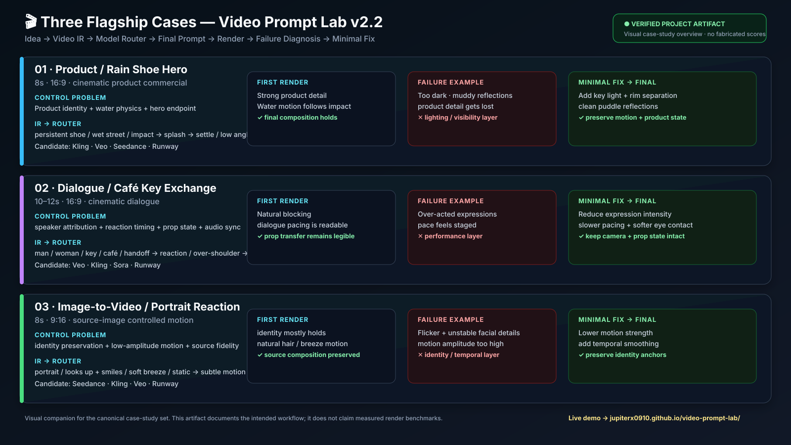

# Flagship Cases — Visual Overview



This visual companion summarizes the three canonical case studies and their intended production loop:

```text
Idea → Video IR → Model Router → Final Prompt → Render → Failure Diagnosis → Minimal Fix
```

## Cases

1. **Product / Rain Shoe Hero** — product identity, water physics, hero composition.
2. **Dialogue / Café Key Exchange** — speaker attribution, reaction timing, prop state, audio sync.
3. **Image-to-Video / Portrait Reaction** — identity preservation, low-amplitude motion, source-image fidelity.

The visual is a project artifact for explaining the methodology. It does **not** claim measured video-generation benchmarks or fabricated render scores.

- Case 1: [product-rain-shoe.md](../examples/cases/product-rain-shoe.md)
- Case 2: [dialogue-cafe-key.md](../examples/cases/dialogue-cafe-key.md)
- Case 3: [i2v-portrait-reaction.md](../examples/cases/i2v-portrait-reaction.md)
- Live compiler: https://jupiterx0910.github.io/video-prompt-lab/
